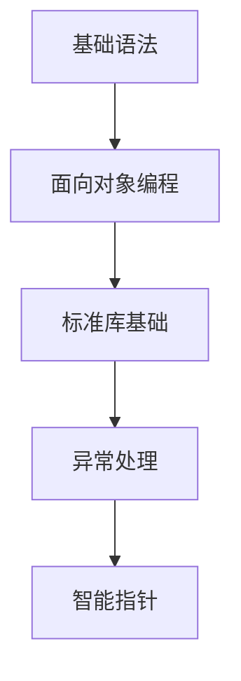
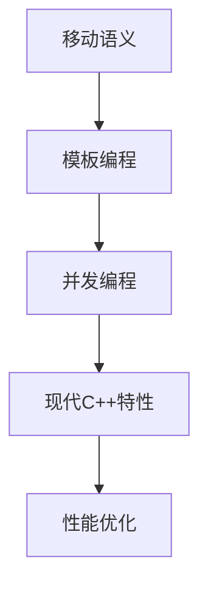
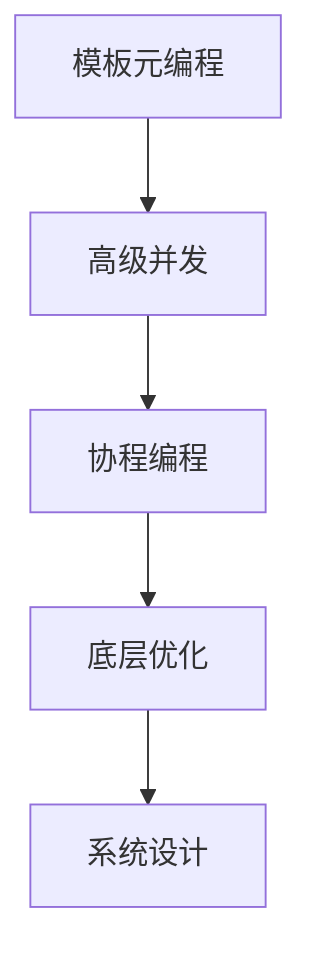

# <div align="center">🚀 C++核心技术深度解析 🚀</div>

<div align="center">
    
    
    
    
</div>

<div align="center">
    <em>深入探讨C++核心技术与底层实现的权威指南</em>
</div>

---

## 📖 序言

> **"C++ is a language where you get to choose your level of abstraction."** - Bjarne Stroustrup

这个系列文章深入探讨了现代C++的核心技术，从模板元编程到协程，从内存模型到对象模型，力求"浅者觉其浅，深者觉其深"。每篇文章都包含了理论讲解、实践代码和性能优化建议，适合不同水平的C++开发者。

---

## 📚 文章目录

| 序号 | 文章标题 | 核心内容 | 难度 |
|------|----------|----------|------|
| 🎯 | [01. 模板元编程的深度解析](./01_%E6%A8%A1%E6%9D%BF%E5%85%83%E7%BC%96%E7%A8%8B.md) | 编译期图灵完备性、SFINAE、类型计算 | ⭐⭐⭐⭐⭐ |
| 🔄 | [02. 移动语义与完美转发的底层实现](./02_%E7%A7%BB%E5%8A%A8%E8%AF%AD%E4%B9%89%E4%B8%8E%E5%AE%8C%E7%BE%8E%E8%BD%AC%E5%8F%91.md) | 左值右值、引用折叠、移动构造函数 | ⭐⭐⭐⭐ |
| ⚡ | [03. 内存模型与原子操作原理](./03_%E5%86%85%E5%AD%98%E6%A8%A1%E5%9E%8B%E4%B8%8E%E5%8E%9F%E5%AD%90%E6%93%8D%E4%BD%9C.md) | 内存序、原子操作、无锁编程 | ⭐⭐⭐⭐⭐ |
| 🛡️ | [04. 异常安全与RAII设计模式](./04_%E5%BC%82%E5%B8%B8%E5%AE%89%E5%85%A8%E4%B8%8ERAII%E8%AE%BE%E8%AE%A1%E6%A8%A1%E5%BC%8F.md) | 异常安全级别、RAII、作用域守卫 | ⭐⭐⭐⭐ |
| 🔧 | [05. C++20 Concepts与模板编程革新](./05_C%2B%2B20Concepts%E4%B8%8E%E6%A8%A1%E6%9D%BF%E7%BC%96%E7%A8%8B%E9%9D%A9%E6%96%B0.md) | 概念约束、requires表达式、标准库Concepts | ⭐⭐⭐⭐ |
| ⏱️ | [06. 编译时计算与constexpr编程](./06_%E7%BC%96%E8%AF%91%E6%97%B6%E8%AE%A1%E7%AE%97%E4%B8%8Econstexpr%E7%BC%96%E7%A8%8B.md) | constexpr函数、编译期算法、C++20新特性 | ⭐⭐⭐⭐ |
| 🏗️ | [07. C++对象模型与虚函数机制](./07_C%2B%2B%E5%AF%B9%E8%B1%A1%E6%A8%A1%E5%9E%8B%E4%B8%8E%E8%99%9A%E5%87%BD%E6%95%B0%E6%9C%BA%E5%88%B6.md) | 内存布局、虚函数表、多重继承、RTTI | ⭐⭐⭐⭐⭐ |
| 🎭 | [08. 协程与异步编程范式](./08_%E5%8D%8F%E7%A8%8B%E4%B8%8E%E5%BC%82%E6%AD%A5%E7%BC%96%E7%A8%8B%E8%8C%83%E5%BC%8F.md) | 协程状态机、Promise对象、异步IO | ⭐⭐⭐⭐⭐ |
| 🔍 | [09. 模板特化与SFINAE技术](./09_%E6%A8%A1%E6%9D%BF%E7%89%B9%E5%8C%96%E4%B8%8ESFINAE%E6%8A%80%E6%9C%AF.md) | SFINAE原理、std::enable_if、标签分发 | ⭐⭐⭐⭐⭐ |
| 🎨 | [10. C++演进哲学与设计思想](./10_C%2B%2B%E6%BC%94%E8%BF%9B%E5%93%B2%E5%AD%A6%E4%B8%8E%E8%AE%BE%E8%AE%A1%E6%80%9D%E6%83%B3.md) | 零成本抽象、多范式编程、设计原则 | ⭐⭐⭐ |

---

## 🎯 学习路径建议

### 🌱 初学者路径


### 🔥 进阶开发者路径


### 🚀 专家级路径


---

## 💡 核心特色

### 🔬 深度技术剖析
- **底层实现原理**：深入讲解每个特性的底层机制
- **汇编级分析**：展示编译器生成的实际机器码
- **性能对比**：量化不同实现方式的性能差异

### 🛠️ 实用代码示例
```cpp
// 示例：现代C++的最佳实践
template<typename T>
concept Numeric = std::is_arithmetic_v<T>;

template<Numeric T>
constexpr auto safe_add(T a, T b) noexcept {
    if (a > 0 && b > std::numeric_limits<T>::max() - a) {
        throw std::overflow_error("Addition overflow");
    }
    return a + b;
}
```

### 🎨 可视化图表
- **内存布局图解**：直观展示对象在内存中的排列
- **调用流程图**：清晰展现函数调用和返回机制
- **性能对比图表**：量化不同实现的性能差异

### 🏗️ 系统性知识体系
- **纵向深入**：从基础概念到高级应用
- **横向扩展**：关联相关技术点
- **最佳实践**：提供实用的开发建议

---

## 🚀 快速开始

### 📖 阅读建议

1. **按顺序阅读**：建议从第一篇开始，循序渐进
2. **实践代码**：每个示例都建议亲手编译运行
3. **查阅资料**：结合标准文档和其他参考资料
4. **参与讨论**：在实践中遇到问题欢迎交流

### 🔧 环境要求

```bash
# 推荐编译器版本
GCC 11+ / Clang 12+ / MSVC 19.28+

# CMake配置示例
cmake_minimum_required(VERSION 3.20)
project(CppMaster)
set(CMAKE_CXX_STANDARD 20)
set(CMAKE_CXX_STANDARD_REQUIRED ON)
```

### 📚 相关资源

- [C++标准文档](https://isocpp.org/)
- [CppReference](https://en.cppreference.com/)
- [CppCon演讲视频](https://www.youtube.com/user/CppCon)
- [Awesome Modern C++](https://github.com/rigtorp/awesome-modern-cpp)

---

## 🎯 作者的话

> **"C++ is a language where you get to choose your level of abstraction.**
> **You can program at a very high level, expressing algorithms**
> **directly, or you can choose to program at a lower level**
> **closer to the hardware."** - Bjarne Stroustrup

这个系列的文章源于多年的C++开发经验和对底层技术的热爱。我尝试从**实用主义**的角度出发，既要让初学者能够理解，又要让经验丰富的开发者有所收获。

每篇文章都经过精心设计，包含了：
- 📝 **理论讲解**：清晰的概念阐述
- 💻 **代码示例**：实用的代码演示
- 🎯 **最佳实践**：行业内的经验总结
- ⚡ **性能优化**：实用的优化技巧

---

## 🤝 贡献与反馈

如果你在阅读过程中发现问题或有改进建议，欢迎：

1. 🐛 **提交Issue**：报告错误或提出改进建议
2. 💡 **提交PR**：直接改进文档内容
3. 📧 **联系作者**：进行技术交流讨论

---

## 📄 许可证

本项目采用 MIT 许可证 - 详情请查看 [LICENSE](LICENSE) 文件。

---

## 🙏 致谢

感谢所有为C++社区做出贡献的开发者们，特别感谢：
- Bjarne Stroustrup (C++之父)
- Herb Sutter (C++标准委员会主席)
- 以及所有为C++标准库和编译器做出贡献的开发者们

---

<div align="center">
    <strong>让我们一起探索C++的无限可能！</strong>
    <br>
    <em>Exploring the infinite possibilities of C++ together!</em>
    <br><br>
    
</div>